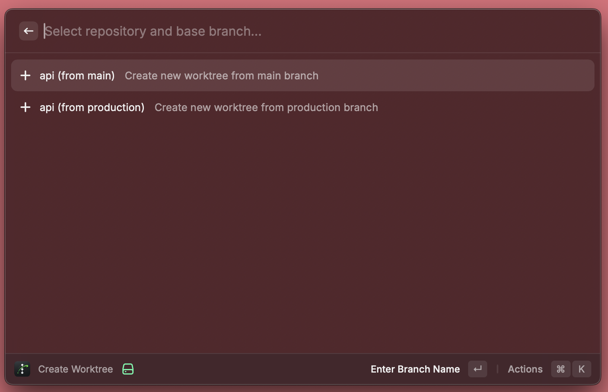

# Treehopper


Hop between git worktrees with ease. Available for both Alfred and Raycast.

## Alfred Workflow

Navigate and create git worktrees directly from Alfred.


**[Download Latest Release](../../releases/latest)** | [Full Documentation](alfred-workflow/README.md)

### Commands

- `wt` - List and open existing worktrees
- `wtn` - Create new worktree with new branch from base

## Raycast Extension

Same functionality for Raycast users.




[Full Documentation](raycast-extension/README.md)

### Commands

- **List Worktrees** - Browse and open existing worktrees
- **Create Worktree** - Create new worktree with new branch

### Install

```bash
cd raycast-extension && npm install && npm run dev
```

---

## Features

- Auto-discover repos or configure manually
- Customizable editor (Cursor, VS Code, Zed, etc.)
- Customizable terminal (Terminal, iTerm, Warp)
- Supports `worktrees.json` for custom setup commands

## How It Works

1. Select a repo and base branch (e.g., `api` from `main`)
2. Enter new branch name (e.g., `feat/my-feature`)
3. Creates worktree with new branch based on selected base
4. Runs setup commands and opens in your editor

## What are Git Worktrees?

Git worktrees let you check out multiple branches simultaneously in separate directories. Instead of stashing changes or committing WIP to switch branches, you can have each branch in its own folder and switch instantly.

```bash
# Traditional workflow (painful)
git stash
git checkout feature-b
# work on feature-b
git checkout feature-a
git stash pop

# Worktree workflow (smooth)
cd ../project-feature-b   # just switch directories
```

**Benefits:**

- Work on multiple features/fixes simultaneously
- No stashing, no WIP commits
- Keep long-running tasks (tests, builds) running while switching context
- Review PRs without disrupting your current work

## worktrees.json

Add a `worktrees.json` to your repo root to customize setup:

```json
{
  "setup-worktree": ["npm install", "cp $ROOT_WORKTREE_PATH/.env .env"]
}
```

## License

MIT
