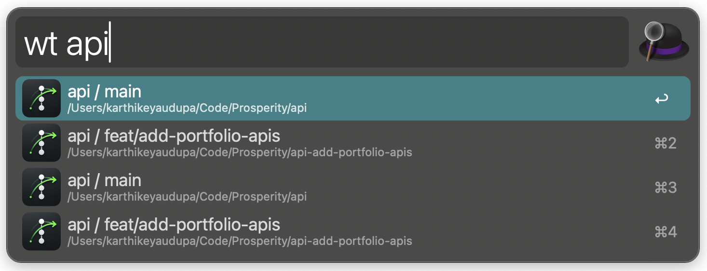
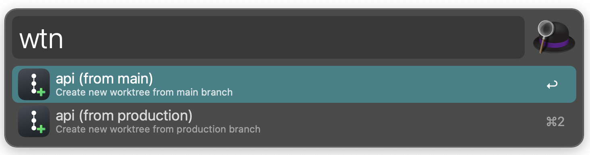

# Treehopper Alfred Workflow

Navigate and create git worktrees from Alfred.

## Install

1. Download `Treehopper.alfredworkflow` from [Releases](https://github.com/insanoid/treehopper/releases)
2. Double-click to install
3. Click the `[x]` icon in Alfred to configure

## Configuration

After installing, configure via Alfred's workflow settings:


| Setting | Description | Example |
|---------|-------------|---------|
| **Repos Directory** | Base path containing repos | `/Users/you/Code` |
| **Auto Discover** | Scan all git repos in directory | Checkbox |
| **Repositories** | Manual list (if auto-discover off) | `api:main:production,frontend:main` |
| **Editor** | CLI command to open worktrees | `cursor`, `code`, `webstorm`, `zed` |
| **Terminal** | Terminal app for Cmd+Enter | `terminal`, `iterm`, `warp` |

### Auto Discover vs Manual

**Auto Discover** (recommended): Enable the checkbox to automatically find all git repos in your directory and detect their default branches.

**Manual**: Specify repos explicitly with format `name:default_branch:hotfix_branch`

- `name` - folder name in repos directory
- `default_branch` - branch for new worktrees (usually `main`)
- `hotfix_branch` - (optional) alternate base branch for hotfixes

**Examples:**
```
api:main:production     # api with main + production branches
frontend:main           # frontend with just main
backend:develop         # backend branching from develop
```

## Usage

### List Worktrees (`wt`)



| Keyword | Action |
|---------|--------|
| `wt` | List all worktrees |

### Create New Worktree (`wtn`)



| Keyword | Action |
|---------|--------|
| `wtn` | Create new worktree |

**Modifiers:**
- `Enter` - Open in editor
- `Cmd+Enter` - Open in terminal

## Prerequisites

- macOS
- [Alfred](https://alfredapp.com) with Powerpack
- Git
- [worktree-cli](https://github.com/johnlindquist/worktree-cli) (optional, for setup scripts)

```bash
pnpm install -g @johnlindquist/worktree
```

## Development

```bash
# Symlink for live editing
./link.sh

# Build .alfredworkflow
./build.sh
```
