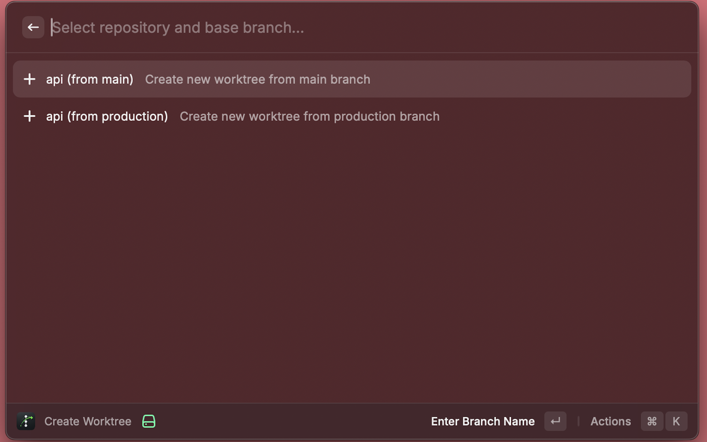

# Treehopper Raycast Extension

Navigate and create git worktrees from Raycast.

## Install

1. Download the latest `Treehopper-Raycast.zip` from [Releases](https://github.com/insanoid/treehopper/releases)
2. Unzip the file
3. Open Terminal and run:
   ```bash
   cd ~/Downloads/Treehopper-Raycast  # or wherever you unzipped
   npm install
   npm run dev
   ```
4. Raycast will open with the extension loaded
5. Configure your settings when prompted

> **Note**: You need [Node.js](https://nodejs.org/) installed. Download the LTS version if you don't have it.

## Commands

### List Worktrees

List all worktrees across your repos.


- `Enter` - Open in editor
- `Cmd+Enter` - Open in terminal
- `Cmd+C` - Copy path
- `Cmd+Shift+F` - Show in Finder

### Create Worktree

Select a repo/branch, enter new branch name, creates worktree and opens in editor.



## Configuration

Configure via Raycast preferences (Cmd+, or click the gear icon):


| Setting             | Description                        | Example                             |
| ------------------- | ---------------------------------- | ----------------------------------- |
| **Repos Directory** | Base path containing repos         | `/Users/you/Code`                   |
| **Auto Discover**   | Scan all git repos in directory    | Checkbox                            |
| **Repositories**    | Manual list (if auto-discover off) | `api:main:production,frontend:main` |
| **Editor**          | CLI command to open worktrees      | `cursor`, `code`, `zed`             |
| **Terminal**        | Terminal app                       | Terminal, iTerm, Warp               |

## Development

```bash
npm run dev    # Start dev mode
npm run build  # Build extension
npm run lint   # Lint code
```
